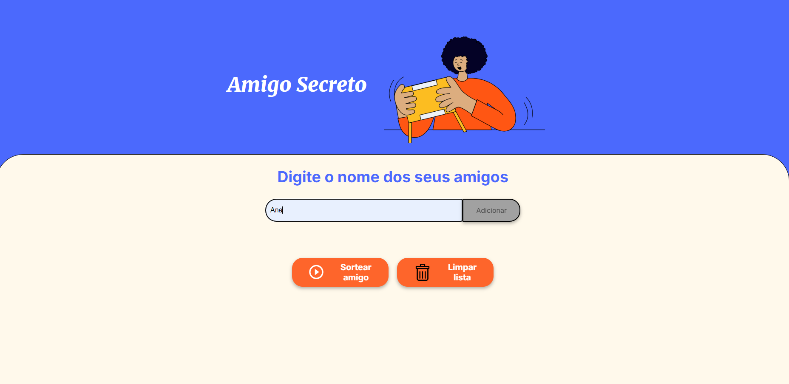
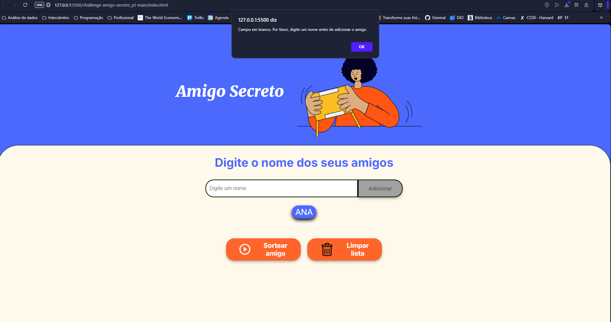
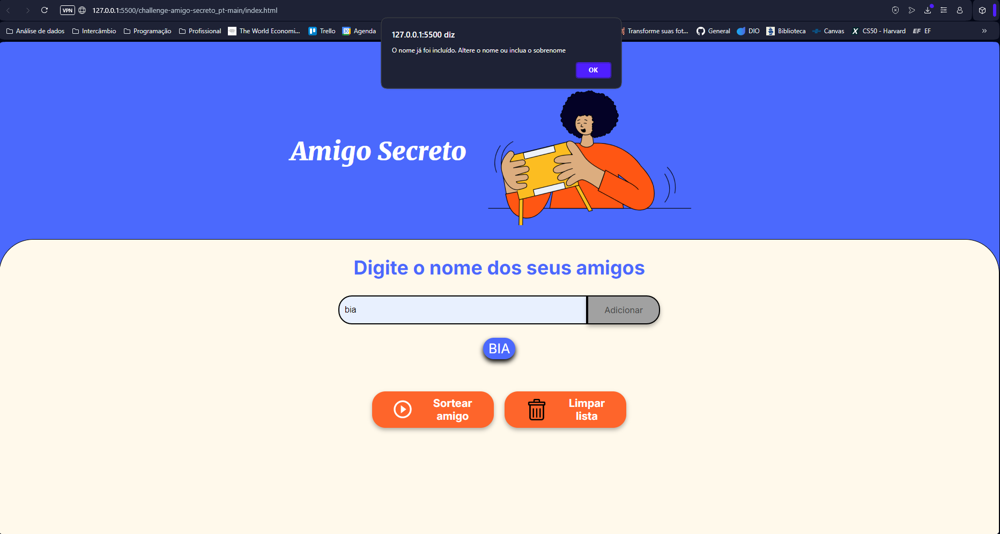
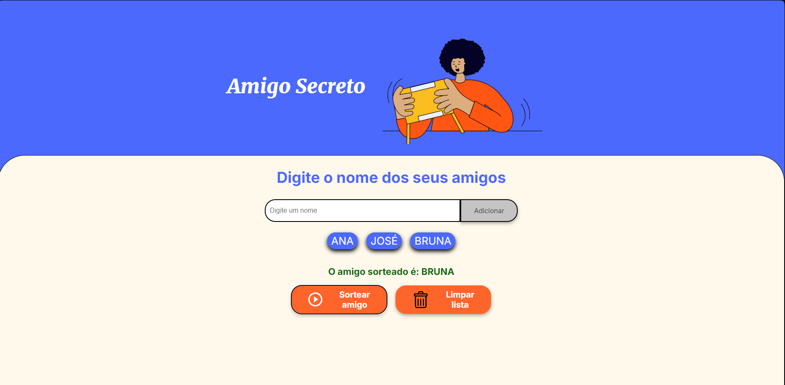
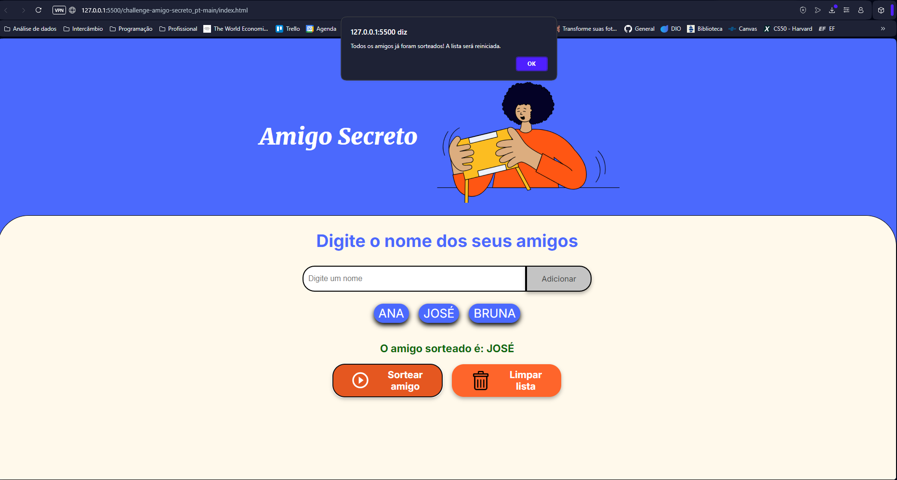
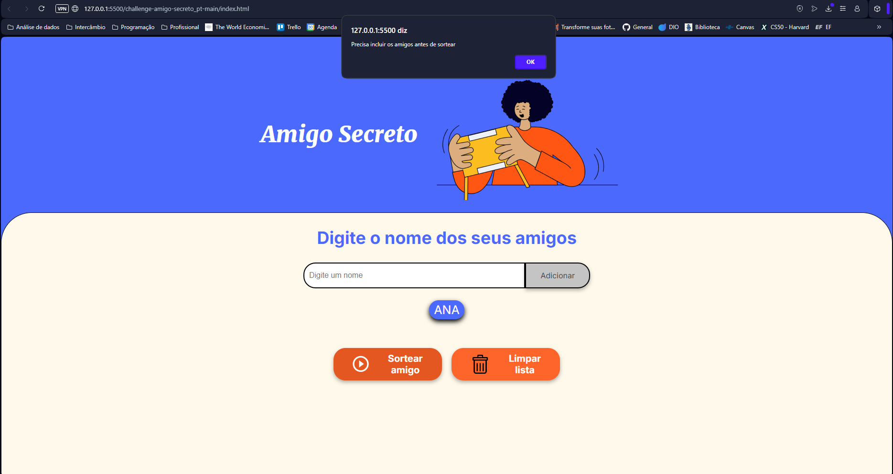

# CHALLENGE - Amigo Secreto

O objetivo desse projeto é colocar em prática o que foi aprendido durante as aulas de lógica de programação.

## Linguagens e ferramentas utilizadas:

## Funcionalidades:
<ul>
<li>Adicionar nomes: Os usuários escreverão o nome de um amigo em um campo de texto e o adicionarão a uma lista visível ao clicar em "Adicionar".</li>
<li>Validar entrada: Se o campo de texto estiver vazio, o programa exibirá um alerta solicitando um nome válido.</li>
<li>Visualizar a lista: Os nomes inseridos aparecerão em uma lista abaixo do campo de entrada.</li>
<li>Sorteio aleatório: Ao clicar no botão "Sortear Amigo", um nome da lista será selecionado aleatoriamente e exibido na página.</li>
<li>Sortear sem repetir: Ao sortear todos os nomes, haverá um alerta informando sobre e será reiniciado o sorteio.</li>
<li>Inclusão de botão: Foi incluso o botão de "Limpar lista" para recomeçar a lista, sem a necessidade de atualizar a página.</li>
<li>Validar nome repetido: Ao tentar incluir um nome repetido, será informado que será necessário digitar outro nome ou acrescentar um sobrenome.</li>
<li>Validar quantidade de pessoas: Se houver menos do que duas pessoas, não será possível fazer o sorteio, nem faria sentido sortear.</li></ul>

## Telas da aplicação:

Não será necessário baixar nenhuma outra ferramenta para utilizar o projeto.
